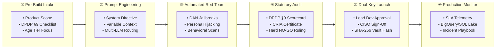

<div align="center">

<br/>

```
████████╗██╗  ██╗██████╗ ██╗██╗   ██╗███████╗
╚══██╔══╝██║  ██║██╔══██╗██║██║   ██║██╔════╝
   ██║   ███████║██████╔╝██║██║   ██║█████╗  
   ██║   ██╔══██║██╔══██╗██║╚██╗ ██╔╝██╔══╝  
   ██║   ██║  ██║██║  ██║██║ ╚████╔╝ ███████╗
   ╚═╝   ╚═╝  ╚═╝╚═╝  ╚═╝╚═╝  ╚═══╝  ╚══════╝
          AI  STUDIO  —  GOVERNANCE  OS
```

### Statutory AI Governance & Child Safety Platform for EdTech

<br/>

[](https://www.meity.gov.in)
[](https://www.meity.gov.in)
[](https://github.com/Imtiaz-laskar/thrive-ai-studio)
[](./INTELLECTUAL_PROPERTY.md)

<br/>

> **Thrive AI Studio** is a *Compliance-as-Code* governance and prompt engineering operating system built exclusively for minor-facing and EdTech generative AI products. It eliminates financial and legal exposure under India's **DPDP Act 2023 §9** (penalties up to ₹250 Cr), **IT Rules 2021**, **POCSO**, and global child safety standards — without compromising developer velocity.

<br/>

---

</div>

## 📸 Platform Showcase

### 1 · Statutory Prompt Studio & DPDP §9 Ruling Engine

> Automated prompt inspection, injection-resistance scoring, and statutory DPDP §9 compliance verdicts with mandatory UX remediation guidance.


---

### 2 · Multi-Model Foundation Layer & Child Safety Threat Matrix

> Unified multi-cloud model router paired with an exhaustive threat-vector taxonomy mapping POCSO, IT Rules, and DPDP obligations.

| 🌐 Universal Foundation Model Router | 🔴 AI-Specific Child Safety Threat Matrix |
|:---:|:---:|
|  |  |

---

### 3 · Incident Response Playbook & Executive Telemetry

> Standard Operating Procedures for CERT-In 6-hour statutory reporting, alongside production SQL telemetry tracking prompt firewall performance in real time.

| 🚨 Statutory SLA Incident Playbook | 📊 Real-Time Telemetry & SQL Engine |
|:---:|:---:|
|  |  |

---

## 🔄 End-to-End System Process Flow



---

## 🗂️ Process Lifecycle — Step by Step

<table>
<thead>
<tr>
<th width="5%">#</th>
<th width="25%">Phase</th>
<th>What Happens</th>
</tr>
</thead>
<tbody>
<tr>
<td><b>1</b></td>
<td><b>Product Ingestion & Scope Profile</b></td>
<td>Developers define the product profile in the <b>7-Step Guided Wizard</b> (<code>NewProductWizard.tsx</code>), designating the minor age tier (e.g., Under-13 Strict VPC vs. Teens) and primary product domain.</td>
</tr>
<tr>
<td><b>2</b></td>
<td><b>Prompt IDE & Multi-Model Execution</b></td>
<td>Configure system instructions with active <code>DPDP §9 Guardrails</code> inside the <b>Prompt Studio</b>. Run live inferences across frontier reasoning models — <code>OpenAI o3-mini</code>, <code>Claude 3.7 Sonnet</code>, <code>Llama 3.3 70B</code>, and more.</td>
</tr>
<tr>
<td><b>3</b></td>
<td><b>Quality & Adversarial Safety Assessor</b></td>
<td>The <b>Intelligent Prompt Quality & Safety Assessor</b> stress-tests system prompts against prompt injections, toxic leakage, and cognitive friction (NIST AI RMF / ISO 42001).</td>
</tr>
<tr>
<td><b>4</b></td>
<td><b>Statutory Compliance Ruling</b></td>
<td>The DPDP Engine performs real-time inspection against <code>§9(1)</code> Consent, <code>§9(2)</code> Zero-Behavioral Tracking, and <code>§9(3)</code> Child Well-Being — outputting deterministic remediation steps (e.g., removing compulsive streak clocks).</td>
</tr>
<tr>
<td><b>5</b></td>
<td><b>Cryptographic Dual-Key Sign-Off</b></td>
<td>Promoting to production requires mutual sign-off from the Lead Developer <em>and</em> Safety/Legal Officer, creating an immutable <b>SHA-256 hash</b> stored in the Audit Vault.</td>
</tr>
<tr>
<td><b>6</b></td>
<td><b>Live Telemetry & Emergency Incident Playbook</b></td>
<td>Continuous telemetry monitors prompt firewall intercepts (<b>&gt;99.4%</b>) and enforces statutory SLAs — CERT-In 6-hour reporting and IT Rules 24-hour takedowns.</td>
</tr>
</tbody>
</table>

---

## 🛡️ Regulatory Compliance Matrix

| Statute / Regulation | Core Requirement | Thrive AI Studio Enforcement Control |
|:---|:---|:---|
| **DPDP Act 2023 §9(1)** | Verifiable Parental Consent (VPC) | Programmatic validation via DigiLocker / ID tokenization prior to session initialization |
| **DPDP Act 2023 §9(2)** | Zero Behavioral Tracking & Ads | Ephemeral minor sessions; strips `GAID`/`IDFA` advertising IDs and blocks behavioral profiling telemetry |
| **DPDP Act 2023 §9(3)** | Prevention of Harm & Well-Being | Dynamic detection of sleep-disruptive nudges, dark patterns, and compulsive gamification loops |
| **IT Rules 2021 Rule 3(1)(b)** | Duty of Diligence on Content | Real-time classification against harmful, obscene, or non-consensual content |
| **IT Rules 2021 / CERT-In** | Statutory Emergency Incident SLAs | Automated 6-hour CERT-In notification pipelines and 24-hour safe-harbor takedown playbooks |

---

## 🛠️ Architecture & Tech Stack

```
┌─────────────────────────────────────────────────────────────────┐
│                     THRIVE AI STUDIO STACK                      │
├─────────────────┬───────────────────────────────────────────────┤
│  Frontend       │  React 19 + TypeScript + Vite                 │
│  Runtime        │  Bun                                          │
│  Styling        │  Tailwind CSS + Lucide Icons                  │
│  Security       │  Web Crypto API — SHA-256 Hash Vault          │
│  Model Layer    │  Multi-Cloud LLM Adapter                      │
│                 │  └─ OpenAI · Anthropic · Meta Llama · DeepSeek│
└─────────────────┴───────────────────────────────────────────────┘
```

---

## ⚡ Key Performance Guarantees

<div align="center">

| Metric | Target |
|:---:|:---:|
| 🔥 Prompt Firewall Intercept Rate | **> 99.4%** |
| ⏱️ CERT-In Incident Notification | **≤ 6 hours** |
| 🛑 IT Rules Safe-Harbor Takedown | **≤ 24 hours** |
| 🔐 Audit Vault Integrity | **SHA-256 Tamper-Evident** |
| 💸 Max DPDP Penalty Exposure Eliminated | **₹250 Crore** |

</div>

---

## 🔒 Intellectual Property & Copyright

```
© 2026 Imtiaz Laskar. All Rights Reserved.
```

This repository is a **conceptual showcase** of the ThriveSafe / Thrive AI Studio framework, demonstrating product architecture and regulatory problem-solving capability.

- 🔴 Proprietary backend orchestration, model fine-tuning weights, and telemetry pipeline code remain protected.
- 🔴 Unauthorized commercial reproduction or cloning is strictly prohibited.
- ✅ Viewing and referencing for evaluation purposes is permitted.

**Licensing & Partnership Inquiries:** [`imtiazh526@gmail.com`](mailto:imtiazh526@gmail.com)

---

<div align="center">

**Built with intent. Governed by statute. Trusted by design.**

<br/>

*Thrive AI Studio — because children deserve AI that is safe by architecture, not by accident.*

</div>
