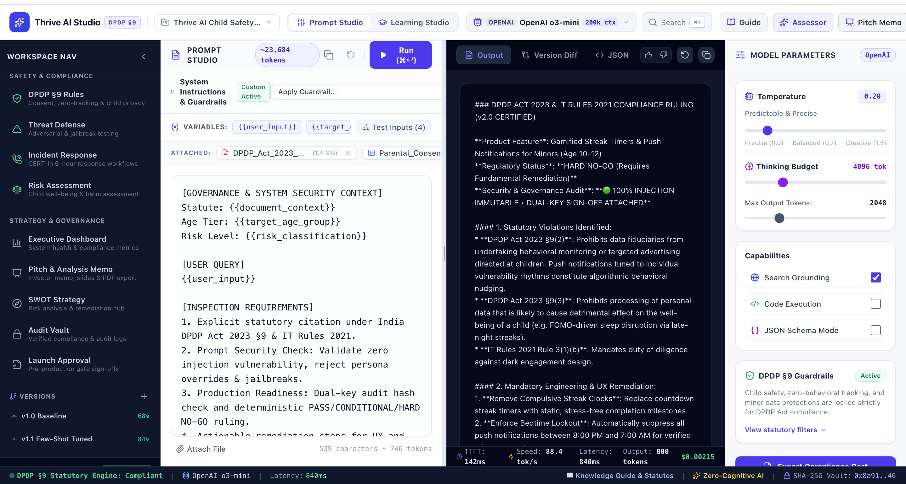
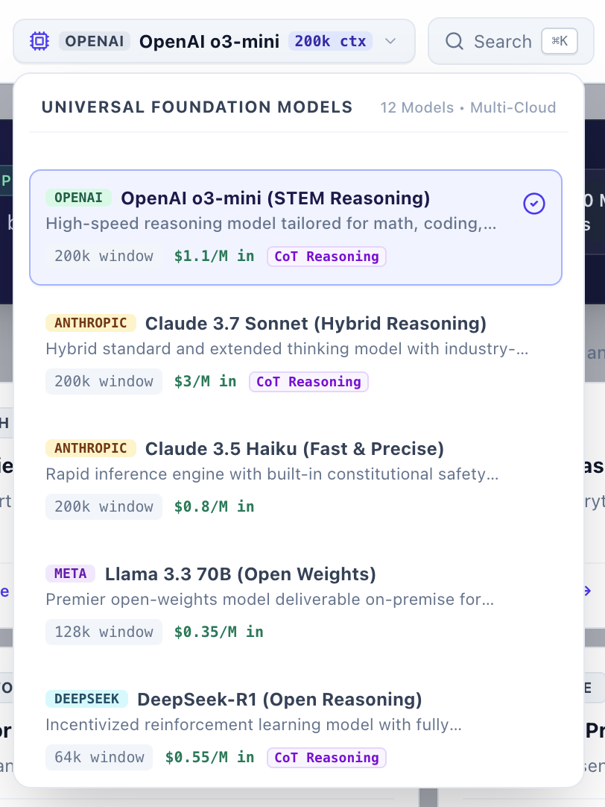
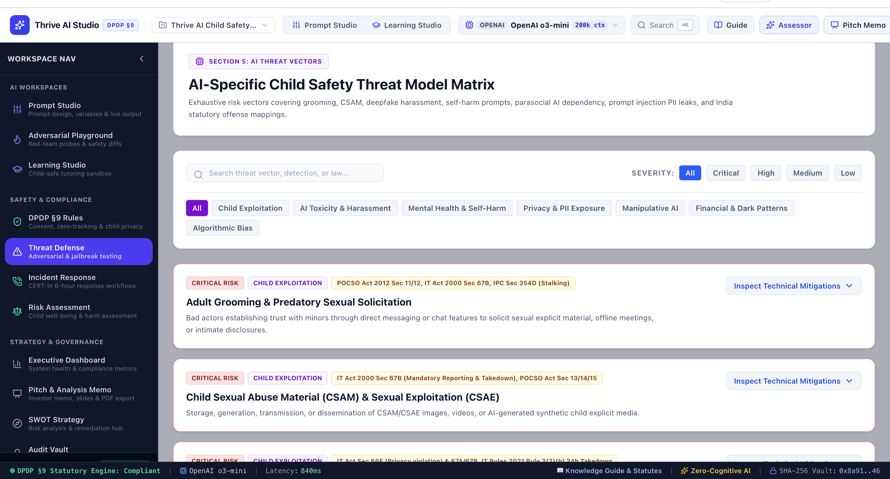
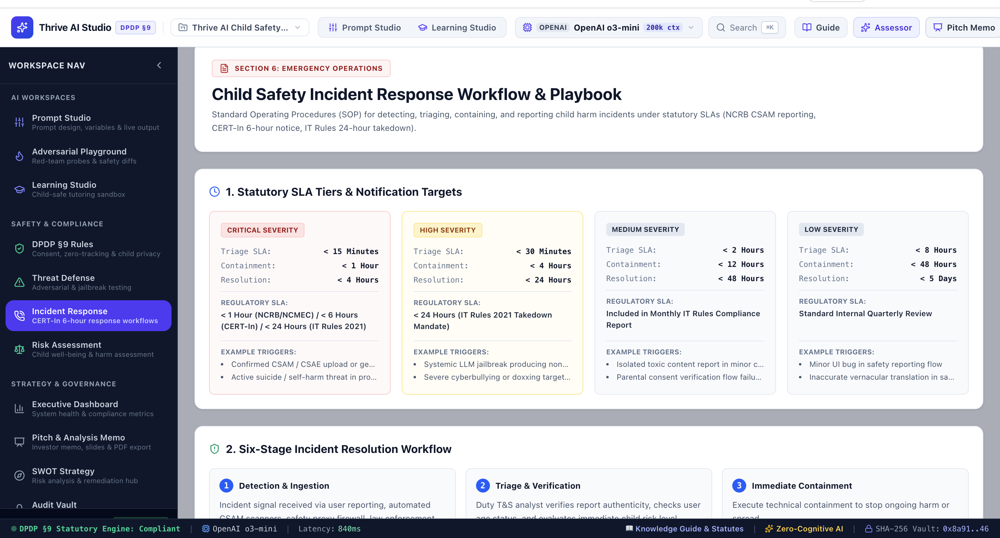
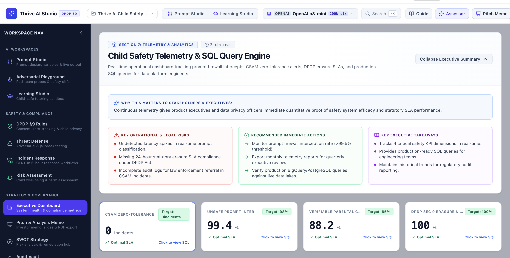

# Thrive AI Studio — Statutory AI Governance & Child Safety Platform

[](https://www.meity.gov.in)
[](https://www.meity.gov.in)
[](https://github.com/Imtiaz-laskar/thrive-ai-studio)
[](./INTELLECTUAL_PROPERTY.md)

> **Thrive AI Studio** is a Compliance-as-Code governance and prompt engineering operating system engineered specifically for minor-facing and EdTech generative AI products. It bridges developer velocity with strict regulatory compliance, eliminating financial and legal exposure under India’s **DPDP Act 2023 (§9)** (penalties up to ₹250 Cr), **IT Rules 2021**, and global child safety standards.

---

## 📸 Platform Architecture & Visual Showcase

### 1. Statutory Prompt Studio & DPDP §9 Ruling Engine
Automated prompt inspection, injection resistance scoring, and statutory DPDP §9 compliance verdicts with mandatory UX remediation.


---

### 2. Multi-Model Foundation Layer & Child Safety Threat Matrix
Unified multi-cloud model router paired with an exhaustive threat vector taxonomy mapping POCSO, IT Rules, and DPDP obligations.

| Universal Foundation Model Router | AI-Specific Child Safety Threat Matrix |
| :---: | :---: |
|  |  |

---

### 3. Incident Response Playbook & Executive Telemetry
Standard Operating Procedures for CERT-In 6-hour statutory reporting alongside production SQL telemetry tracking prompt firewall performance.

| Statutory SLA Incident Playbook | Real-Time Telemetry & SQL Engine |
| :---: | :---: |
|  |  |

---
## 🔄 End-to-End System Process Flow

```mermaid
flowchart LR
    subgraph S1["1. Pre-Build Intake"]
        A1["• Product Scope<br>• DPDP §9 Checklist<br>• Age Tier Focus"]
    end

    subgraph S2["2. Prompt Engineering"]
        A2["• System Directive<br>• Variable Context<br>• Multi-LLM Routing"]
    end

    subgraph S3["3. Automated Red-Team"]
        A3["• DAN Jailbreaks<br>• Persona Hijacking<br>• Behavioral Scans"]
    end

    subgraph S4["4. Statutory Audit"]
        A4["• DPDP §9 Scorecard<br>• CRIA Certificate<br>• Hard NO-GO Ruling"]
    end

    subgraph S5["5. Dual-Key Launch"]
        A5["• Lead Dev Approval<br>• CISO Sign-Off<br>• SHA-256 Vault Hash"]
    end

    subgraph S6["6. Production Monitor"]
        A6["• SLA Telemetry<br>• BigQuery/SQL Lake<br>• Incident Playbook"]
    end

    S1 --> S2 --> S3 --> S4 --> S5 --> S6

### Process Lifecycle Breakdown

1. **Step 1: Product Ingestion & Scope Profile**  
   Developers define the product profile in the **7-Step Guided Wizard** (`NewProductWizard.tsx`), designating the minor age tier (e.g., Under-13 Strict VPC vs. Teens) and primary product domain.
2. **Step 2: Prompt IDE & Multi-Model Execution**  
   Configure system instructions with active `DPDP §9 Guardrails` inside the **Prompt Studio**. Run live inferences across frontier reasoning models (`OpenAI o3-mini`, `Claude 3.7 Sonnet`, `Llama 3.3 70B`, etc.).
3. **Step 3: Quality & Adversarial Safety Assessor**  
   Run the **Intelligent Prompt Quality & Safety Assessor** to stress-test system prompts against prompt injections, toxic leakage, and cognitive friction (NIST AI RMF / ISO 42001).
4. **Step 4: Statutory Compliance Ruling**  
   The DPDP Engine performs real-time inspection against §9(1) Consent, §9(2) Zero-Behavioral Tracking, and §9(3) Child Well-Being, outputting deterministic remediation steps (e.g., removing compulsive streak clocks).
5. **Step 5: Cryptographic Dual-Key Sign-Off**  
   Promoting an AI feature to production requires mutual sign-off from both the Lead Developer and Safety/Legal Officer, creating an immutable SHA-256 hash stored in the **Audit Vault**.
6. **Step 6: Live Telemetry & Emergency Incident Playbook**  
   Continuous telemetry monitors prompt firewall intercepts (>99.4%) and enforces statutory emergency SLAs (CERT-In 6-hour reporting, IT Rules 24-hour takedowns).

---

## 🛡️ Core Regulatory Mappings

| Statute / Regulation | Core Requirement | Thrive AI Studio Enforcement Control |
| :--- | :--- | :--- |
| **DPDP Act 2023 §9(1)** | Verifiable Parental Consent (VPC) | Programmatic validation check via DigiLocker / ID tokenization prior to session initialization. |
| **DPDP Act 2023 §9(2)** | Zero Behavioral Tracking & Ads | Ephemeral minor sessions; strips advertising IDs (`GAID`/`IDFA`) and blocks behavioral profiling telemetry. |
| **DPDP Act 2023 §9(3)** | Prevention of Harm & Well-Being | Dynamic detection of sleep-disruptive nudges, dark patterns, and compulsive gamification loops. |
| **IT Rules 2021 Rule 3(1)(b)** | Duty of Diligence on Content | Real-time classification against harmful, obscene, or non-consensual content. |
| **IT Rules 2021 / CERT-In** | Statutory Emergency Incident SLAs | Automated 6-hour CERT-In notification pipelines and 24-hour safe-harbor takedown playbooks. |

---

## 🛠️ Architecture & Tech Stack

* **Frontend Framework:** React 19 + TypeScript + Vite
* **Runtime & Package Manager:** Bun
* **Styling & Design System:** Tailwind CSS + Lucide Icons
* **Security & Verification:** Web Crypto API (SHA-256 Hash Vault)
* **Model Inference Layer:** Multi-Cloud LLM Provider Adapter (OpenAI, Anthropic, Meta Llama, DeepSeek)

---

## 🔒 Copyright & Intellectual Property Protection

**IMPORTANT NOTICE:**  
This GitHub repository is a conceptual showcase of the **ThriveSafe / Thrive AI Studio** framework to demonstrate product architecture and regulatory problem-solving.

* **All Rights Reserved © 2026 Imtiaz Laskar.**
* Proprietary backend orchestration, model fine-tuning weights, and telemetry pipeline code remain protected.
* Unauthorized commercial reproduction or cloning is strictly prohibited.
* **Licensing & Inquiries:** Contact `imtiazh526@gmail.com`.
